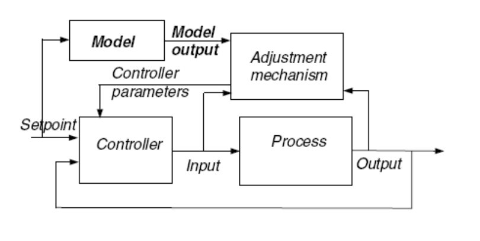

# 模型参考自适应控制

模型参考自适应控制(model reference adaptive control, 简称 mrac) 可以视为跟随参考模型 (reference model)的自适应伺服系统(adaptive servo system) 。 更具体的说，对于相同的输入我们希望被控制系统的输出特性和参考系统的输出特性是一致的。

上图是模型参考自适应控制的基本框图，控制器的参数根据参考模型的输出和实际系统输出的误差实时变化。

## 基于Lyapunov稳定性设计MRAC

### Lyapunov稳定性理论

#### 非线性时不变系统

考虑非线性时不变系统
$$
\dot{x} = f(x)~~~f(0) = 0~~~~~~(1)
$$
首先我们求取平衡点 (equilibrium point) , 令$f(x) = 0$ 得到结果: $x(t) = 0$, 下面我们需要证明平衡点$x (t) = 0$是稳定的.  

Lyapunov稳定性定义如下:
$$
如果对于给定的\epsilon > 0, 存在\delta(\epsilon) > 0, 当初始状态||x(0)|| < \delta, 后续状态满足性质: ||x(t)|| < \epsilon, 0 \leq t \leq \infty \\
那么我们称平衡点x(t) = 0是稳定 (stable)~的
$$

$$
如果当初始状态||x(0)|| \leq \delta, 后续状态变化满足 ||x(t)|| \to 0, t \to \infty, \\
那么我们称平衡点x(t) = 0是渐进稳定 (asymptotically~stable)~的.
$$

$$

$$

#### 非线性时变系统

### 基本步骤

1. 确定控制器结构
2. 推导误差方程
3. 找出Lyapunov方程
4. 
5. 推导满足Lyapunov理论的自适应变化率

### 一阶系统 (first- order system) Lyapunov MRAC 设计

对于车辆横向和纵向执行系统, 我们都可以使用简单的一阶系统对其进行建模

系统模型
$$
\dfrac{dy}{dt} = -ay + bu~~~~~~~(1)
$$

参考模型
$$
\dfrac{dy_{m}}{dt} = -a_{m}y_{m} + b_{m}u_{c}~~~~~~~(2)
$$
控制器
$$
u = \theta_{1}u_{c} + \theta_{2}y~~~~~~~(3)
$$

接下来我们引入误差变量
$$
e= y- y_{m}~~~~~~~(4)
$$

我们希望减小误差变量, 因此我们需要对上述误差量进行求导
$$
\dfrac{de}{dt} = -a_{m}e - (b\theta_{2} + a - a_{m})y + (b\theta_{1} - b_{m})u_{c}~~~~~~~(5)
$$
对于模型参考自适应控制, 我们需要根据当前误差$e$实时的去修改参数$\theta_{1}$和$\theta_{2}$ , 我们假设$b\gamma > 0$ 并且引入下面二次函数作为Lyapunov函数
$$
V(e, \theta_{1}, \theta_{2}) = \dfrac{1}{2}(e^{2} + \dfrac{1}{b \gamma}(b\theta_{2} + a - a_{m})^{2} + \dfrac{1}{b\gamma}(b\theta_{1} - b_{m})^{2})
$$
 我们希望建立一种参数调整机制, 使得参数误差量$e$最终可以收敛到$0$. 要想满足这一要求Lyapunov函数的导数$\dfrac{dV}{dt}$ 需要是负数.
$$
\dfrac{dV}{dt} = e\dfrac{de}{dt} + \dfrac{1}{\gamma}(b\theta_{2}+a-a{m})\dfrac{d\theta_{2}}{dt} + \dfrac{1}{\gamma}(b\theta_{1} - b_{m})\dfrac{d\theta_{1}}{dt} \\
=-a_{m}e^{2} + \dfrac{1}{\gamma}(b\theta_{2} + a - a_{m})(\dfrac{d\theta_{2}}{dt} - \gamma ye) + \dfrac{1}{\gamma}(b\theta_{1} - b_{m})(\dfrac{d\theta_{1}}{dt}+\gamma u_{c}e)
$$
如果我们采取如下参数更新的方式
$$
\dfrac{d\theta_{1}}{dt} = -\gamma u_{c}e 
$$

$$
\dfrac{d\theta_{2}}{dt} = \gamma y e
$$

式(12)可以简化为
$$
\dfrac{dV}{dt} = -a_{m}e^{2}
$$

Lyapunov函数的一阶导数是负半定的而不是负定的

$V$的二阶倒数
$$
\dfrac{d^{2}V}{dt^{2}} = -2a_{m}e\dfrac{de}{dt} = -2a_{m}e(-a_{m}e - (b\theta_{2} + a - a_{m})y + (b\theta_{1} - b_{m})u_{c})
$$

